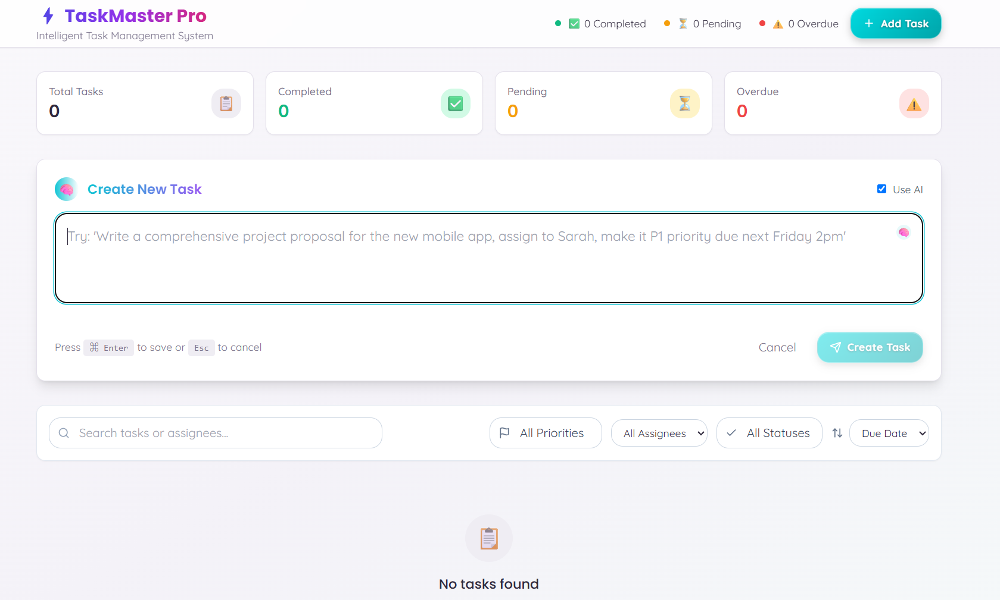
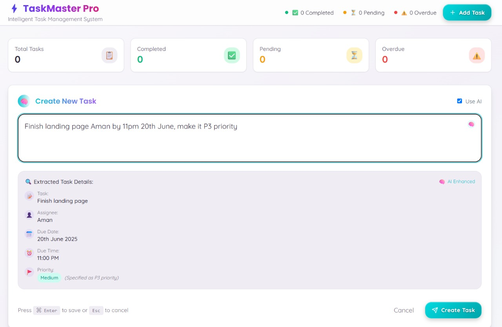
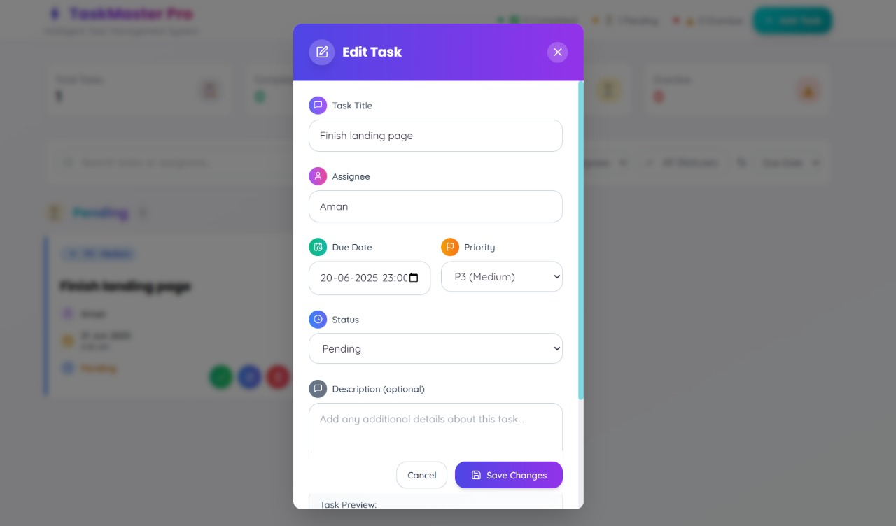

# ⚡ TaskMaster Pro

Transform your thoughts into organized, actionable tasks with the power of AI.



---

## 🚀 Overview

TaskMaster Pro is a next-generation, AI-powered task manager that turns your natural language input into structured, actionable tasks. Enjoy a beautiful, modern interface and let advanced AI handle the details—so you can focus on what matters.

---

## ✨ Features

- **AI-Powered Task Parsing**: Enter tasks in plain English—AI extracts the task, assignee, due date, and priority.
- **Smart Date & Priority Recognition**: Understands phrases like "next Monday" or "urgent" and assigns the right due date and priority.
- **Contextual Assignee Detection**: Detects names and assigns tasks accordingly.
- **Full Task Management**: Add, edit, complete, and delete tasks with ease.
- **Modern, Responsive UI**: Clean design, soothing gradients, and smooth animations for a delightful experience on any device.
- **Persistent Storage**: Your tasks are saved locally, so you never lose your progress.

---

## 🖼️ Screenshots

| Main Interface | Editing Tasks |
|:--------------:|:------------:|
|  |  |

---

## 🧠 How It Works

1. **Type a task**: e.g., "Email Sarah the project update by Friday, high priority."
2. **AI parses your input**: Extracts the action, assignee, due date, and priority.
3. **Task is added**: Instantly appears in your task list, ready to manage.

---

## 🛠️ Tech Stack

- **Frontend**: React, TypeScript, Vite
- **UI**: Tailwind CSS, Shadcn UI
- **AI**: OpenAI GPT-4o API
- **State Management**: React Hooks

---

## ⚡ Quick Start

1. **Clone the repository**
2. **Install dependencies**
   ```bash
   npm install
   ```
3. **Configure your API key**
   - Create a `.env` file in the root:
     ```
     VITE_OPENAI_API_KEY=your_openai_api_key_here
     VITE_DEBUG_MODE=false
     ```
4. **Run the app**
   ```bash
   npm run dev
   ```

---

## 💡 Example Inputs

- "Schedule team meeting for next Wednesday at 2pm, assign to Alex, high priority."
- "Review pull requests by tomorrow."
- "Update documentation, low priority."

The AI will extract:
- **Task name** (clear, actionable)
- **Assignee** (if mentioned)
- **Due date/time** (with smart defaults)
- **Priority** (P1–P4, based on urgency)

---

## 📁 Project Structure

- `components/` – UI components
- `utils/` – Utility functions and AI parsers
- `types/` – TypeScript types
- `pages/` – Main app pages

---

## 🤝 Contributing

Contributions are welcome! Please open issues or submit pull requests for improvements or bug fixes.

---

## 📄 License

MIT

## Project info

*URL*: https://lovable.dev/projects/9bef710b-23dc-480d-9104-a5d953bb88d9

## How can I edit this code?

There are several ways of editing your application.

*Use Lovable*

Simply visit the [Lovable Project](https://lovable.dev/projects/9bef710b-23dc-480d-9104-a5d953bb88d9) and start prompting.

Changes made via Lovable will be committed automatically to this repo.

*Use your preferred IDE*

If you want to work locally using your own IDE, you can clone this repo and push changes. Pushed changes will also be reflected in Lovable.

The only requirement is having Node.js & npm installed - [install with nvm](https://github.com/nvm-sh/nvm#installing-and-updating)

Follow these steps:

sh
# Step 1: Clone the repository using the project's Git URL.
git clone <YOUR_GIT_URL>

# Step 2: Navigate to the project directory.
cd <YOUR_PROJECT_NAME>

# Step 3: Install the necessary dependencies.
npm i

# Step 4: Start the development server with auto-reloading and an instant preview.
npm run dev


*Edit a file directly in GitHub*

- Navigate to the desired file(s).
- Click the "Edit" button (pencil icon) at the top right of the file view.
- Make your changes and commit the changes.

*Use GitHub Codespaces*

- Navigate to the main page of your repository.
- Click on the "Code" button (green button) near the top right.
- Select the "Codespaces" tab.
- Click on "New codespace" to launch a new Codespace environment.
- Edit files directly within the Codespace and commit and push your changes once you're done.

## What technologies are used for this project?

This project is built with:

- Vite
- TypeScript
- React
- shadcn-ui
- Tailwind CSS